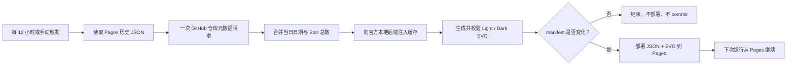

<h1 align="center">⭐ Deploy Star History Pages</h1>

<p align="center">
  用 GitHub Actions 运行官方 star-history.com 开源渲染器，在 GitHub Pages 保存本地数据，把项目自身的明暗主题曲线和历史状态发布到项目自有 GitHub Pages，不再依赖云端数据与外部接口。
</p>

<p align="center">
  <a href="skills/deploy-star-history-pages/SKILL.md"></a>
  
  
  
  <a href="LICENSE"></a>
</p>

<p align="center">
  <strong>简体中文</strong> · <a href="README_EN.md">English</a>
</p>

> [!IMPORTANT]
> **这个 Skill 用于解决托管 Star History 图片接口宕机、限流或返回异常时，GitHub README 曲线失效的问题。**
>
> README 不再热链 `api.star-history.com`。工作流在仓库自己的 Actions Runner 中运行固定版本的官方渲染源码，只查询一次 GitHub 仓库元数据，将明暗 SVG 与日期/星标总数 JSON 发布到项目自己的 Pages。无需 PAT，不请求个人 Stargazer 列表，也不通过定时 commit 保存历史。

<table width="100%">
  <tr>
    <th width="50%">Light</th>
    <th width="50%">Dark</th>
  </tr>
  <tr>
    <td></td>
    <td></td>
  </tr>
</table>

<p align="center"><sub>真实效果取自 <a href="https://github.com/MDX-Tom/gpt-5.6-instruct">MDX-Tom/gpt-5.6-instruct</a> 的 GitHub Pages 部署。</sub></p>

## 为什么需要它

托管图片很方便，但 README 的每次渲染都会依赖外部动态接口。一旦接口超时、限流或认证参数失效，项目首页就会出现裂图。

`deploy-star-history-pages` 把生成、存储和展示都收回到仓库自身：

| | 托管图片接口 | 本 Skill 的 Pages 方案 |
| --- | --- | --- |
| 图片来源 | README 请求外部动态接口 | README 读取项目自己的 Pages 静态 SVG |
| 故障隔离 | 接口故障立即影响 README | 上一份 Pages 产物在刷新间隔内持续可用 |
| 数据刷新 | 请求时动态生成 | 默认每 12 小时，支持手动运行 |
| 数据请求 | 服务端策略不透明 | 每次只读取一次仓库元数据，不列出 Stargazer |
| 渲染实现 | 托管服务 | Runner 内运行官方 `star-history/star-history` 源码 |
| 历史状态 | 服务端维护 | 项目 Pages 上的 `star-history-data.json` |
| 凭据 | URL 参数或服务端策略 | 仅使用任务自带的 `${{ github.token }}`，无需 Secret |
| Git 历史 | 不适用 | 定时刷新不创建 commit |
| Pages 部署 | 不透明 | 仅当 JSON/SVG manifest 变化时部署 |

## 安装 Skill

### 使用 Skills CLI

```bash
npx skills add MDX-Tom/star-history-skill \
  --skill deploy-star-history-pages \
  -g -a codex -y
```

也可以去掉 `-g` 安装到当前项目，或把 `codex` 换成 Skills CLI 支持的其他 Agent。

### 本地开发安装

在本仓库根目录执行：

```bash
mkdir -p ~/.codex/skills
ln -sfn "$PWD/skills/deploy-star-history-pages" \
  ~/.codex/skills/deploy-star-history-pages
```

## 快速使用

在目标 GitHub 项目中调用 Skill：

```text
使用 $deploy-star-history-pages 为当前仓库部署项目自身的 Star History。
同步修改中英文 README，使用 GitHub Pages 明暗主题 SVG，并完成本地验证。
```

Agent 会：

1. 读取项目规范、README、Git remote 与已有 Pages 配置。
2. 识别旧 `.github/scripts/render_star_history.py`，经审阅后移除不再使用的副本。
3. 生成统一的 `.github/scripts/star_history.py`。
4. 生成 `.github/data/star-history-data.json` 冷启动种子。
5. 生成 `.github/workflows/sync-star-history.yml`。
6. 把 README 图片改成项目 Pages 的 `<picture>` 块。
7. 执行 Python、模板占位符、Workflow、测试和 diff 检查。
8. 说明尚需启用的 Pages 设置；只有在你要求远程部署时才触发并验证工作流。

### 直接运行安装器

```bash
python3 skills/deploy-star-history-pages/scripts/install.py \
  --root /path/to/your-repository \
  --repository owner/repository
```

常用选项：

```text
--dry-run                 只显示计划，不写文件
--force                   覆盖内容不同的既有生成文件
--pages-url URL           使用自定义域名或非默认 Pages URL
--source-ref REF          指定官方 Star History 分支、Tag 或 commit SHA
--cron "23 */12 * * *"   自定义 UTC 刷新周期
--no-snippet              不打印 README 代码块
```

安装器会打印可直接放进 README 的代码：

```html
<picture>
  <source media="(prefers-color-scheme: dark)" srcset="https://owner.github.io/repository/star-history-dark.svg" />
  <source media="(prefers-color-scheme: light)" srcset="https://owner.github.io/repository/star-history-light.svg" />
  
</picture>
```

## 首次部署配置

### 1. 启用 GitHub Actions Pages

打开：

```text
Settings → Pages → Build and deployment → Source → GitHub Actions
```

无需创建 PAT 或 Repository Secret。工作流只在当前任务内使用 GitHub 自动提供的 `${{ github.token }}`。

### 2. 运行并检查

```bash
gh workflow run sync-star-history.yml --repo owner/repository
gh run watch --repo owner/repository --exit-status

curl -fL https://owner.github.io/repository/star-history-data.json -o /tmp/star-history-data.json
curl -fL https://owner.github.io/repository/star-history-light.svg -o /tmp/star-history-light.svg
curl -fL https://owner.github.io/repository/star-history-dark.svg -o /tmp/star-history-dark.svg
```

首次由默认种子启动时，历史会从“仓库创建时 0 Star”与“当前总数”两个点开始；此后按 UTC 日期维护快照。它不会反查每位 Stargazer 的历史时间。如需迁移完整已有曲线，请在首次部署前提供已验证的历史 JSON，或保持原 Pages JSON 可访问。

## 核心特性

- **摆脱托管图片 API**：README 与工作流均不调用 `api.star-history.com/chart`。
- **保留官方视觉实现**：继续使用官方 JSDOM、`XYChart`、xkcd 风格、主题和 SVGO 渲染路径。
- **无 PAT / 无 Secret**：使用短生命周期 `${{ github.token }}` 完成一次仓库元数据请求。
- **不请求 Stargazer 列表**：只读取当前 `stargazers_count`，避免分页、二级限流与个人列表处理。
- **Pages 保存运行态历史**：自动读取并更新公开的 `star-history-data.json`。
- **不自动 commit**：计划任务只部署 Pages Artifact，不改 Git 分支。
- **按日合并**：同一 UTC 日期更新最后一个点，新日期追加一个点。
- **明暗主题自适应**：同时发布 Light / Dark SVG，通过 `<picture>` 自动切换。
- **按变化部署**：JSON 和 SVG 的 manifest 未变化时跳过 Pages 部署。
- **失效保护**：只有 Pages JSON 返回 404 才使用本地种子；其他下载或校验错误停止更新，避免覆盖历史。
- **可审计上游**：默认固定经过验证的官方 commit SHA。
- **清理部署记录**：保留最新 `github-pages` deployment 记录，不影响 Git commit 历史。

## 工作原理



统一脚本提供三个子命令：

1. `refresh-data`：读取 Pages JSON，查询当前仓库总数，并按日更新历史。
2. `patch-upstream`：窄范围修改固定版本官方后端，使其从本地 JSON 初始化缓存。
3. `render`：只访问 `127.0.0.1`，校验并原子写入两种主题 SVG；本地渲染临时失败时可复用上一份 Pages 图对。

## 生成的项目文件

```text
.github/
├── data/
│   └── star-history-data.json
├── scripts/
│   └── star_history.py
└── workflows/
    └── sync-star-history.yml
```

Pages Artifact 包含：

```text
.nojekyll
manifest.sha256
star-history-data.json
star-history-light.svg
star-history-dark.svg
```

其中 `.github/data/star-history-data.json` 是冷启动种子，Pages 上的同名文件才是日常运行的状态源。正常情况下无需从 Pages 手动同步回本地；只有需要额外冷备份时，才在人工审阅后将 Pages JSON 写回仓库并提交一次维护 commit。

## 验证

```bash
python3 -m py_compile \
  skills/deploy-star-history-pages/scripts/install.py \
  skills/deploy-star-history-pages/assets/star_history.py

python3 -m unittest discover -s tests -v

git diff --check
```

安装到目标仓库后，如本机已有 `actionlint`：

```bash
actionlint .github/workflows/sync-star-history.yml
```

维护 Skill 时还应使用 Codex `skill-creator` 的 `quick_validate.py` 校验 `SKILL.md` 元数据，并在临时仓库执行一次安装测试。

## 常见问题

### 历史 JSON 到底存在哪里？

运行态保存在项目 Pages 的 `star-history-data.json`，Actions 会自动读取和更新；仓库里的 `.github/data/star-history-data.json` 只是首次部署或 Pages 被重置后的种子。日常无需手工同步。

### 每 12 小时会产生一次 commit 吗？

不会。工作流部署 Pages Artifact，不向 Git 分支写入内容；而且 manifest 未变化时连 Pages 部署都会跳过。

### 还需要配置 Access Token 吗？

不需要。默认工作流使用 GitHub 自动注入、仅在当前任务有效的 `${{ github.token }}`，并只请求一次仓库元数据。

### 托管 `star-history.com` 服务再次宕机会怎样？

README 加载项目自己的 Pages SVG，刷新也不调用托管图表接口，因此其宕机不会中断这条路径。工作流仍依赖官方 GitHub 源码仓库与 npm 依赖可获取。

### 可以提高刷新频率吗？

可以通过 `--cron` 修改。由于每次只请求一次仓库元数据，API 压力较小；仍应考虑 Actions 和 Pages 使用量。

### Pages 被删除后怎么办？

工作流只在 Pages JSON 返回 404 时退回仓库种子。默认种子会重新初始化为两点历史。若你需要灾难恢复，定期人工备份 Pages JSON 到 `.github/data/`，详情见 [`operations.md`](skills/deploy-star-history-pages/references/operations.md)。

### 官方源码更新后工作流失败怎么办？

查看 [`operations.md`](skills/deploy-star-history-pages/references/operations.md)。重点检查 `backend/main.ts` 的启动结构与 `/svg` 路由，在完成构建和双主题视觉验证后再更新固定 SHA。

### 支持私有仓库吗？

取决于 GitHub 套餐与 Pages 可见性。公开 Pages JSON/SVG 会暴露仓库名称与增长趋势，部署前应确认可见性要求。

## 项目来源与致谢

这个 Skill 同步并泛化自 [`MDX-Tom/gpt-5.6-instruct`](https://github.com/MDX-Tom/gpt-5.6-instruct) 的当前生产方案：

- Pages JSON 作为运行态历史；
- 每次一次仓库元数据请求；
- 本地缓存注入官方渲染器；
- Light / Dark SVG 完整校验；
- manifest 按变化部署；
- 无 PAT、无个人 Stargazer 列表、无计划任务 Git commit。

图像渲染来自官方开源仓库 [`star-history/star-history`](https://github.com/star-history/star-history)。

## License

[MIT](LICENSE)
