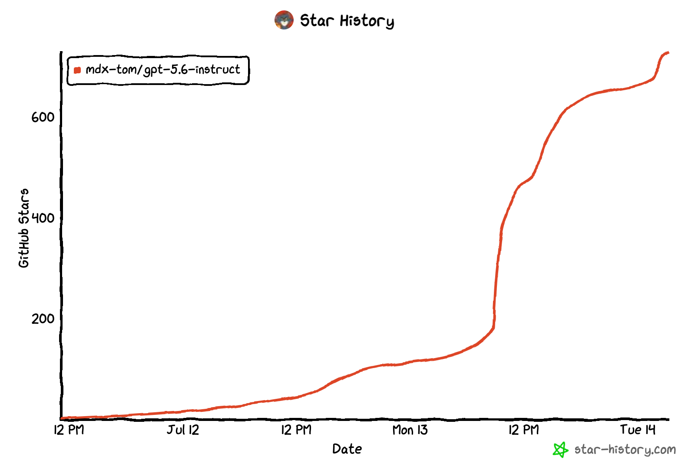
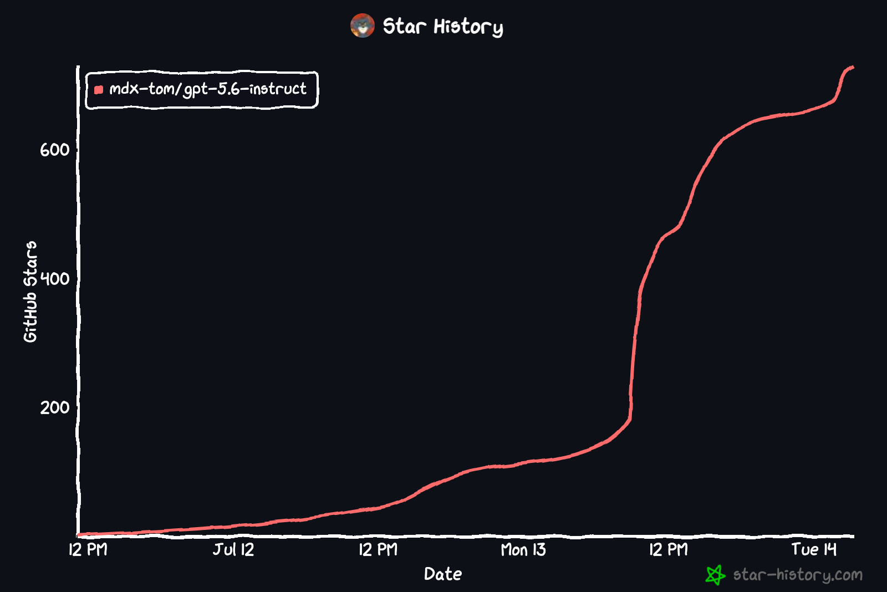
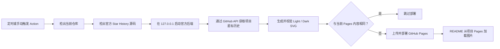

<h1 align="center">⭐ Deploy Star History Pages</h1>

<p align="center">
  用 GitHub Actions 运行官方 Star History 渲染器，并把项目自身的明暗主题曲线发布到 GitHub Pages。
</p>

<p align="center">
  <a href="skills/deploy-star-history-pages/SKILL.md"></a>
  
  
  
  <a href="LICENSE"></a>
</p>

<p align="center">
  <strong>简体中文</strong> · <a href="README_EN.md">English</a>
</p>

> [!IMPORTANT]
> **这个 Skill 直接解决 `star-history.com` 官方图片 API 经常宕机、限流或返回异常，导致 GitHub README 无法显示实时 Star History 图片的问题。**
>
> 它不再从 `api.star-history.com` 热链图片，而是定时在你自己的 GitHub Actions Runner 中启动官方 Star History 后端、直接读取 GitHub 星标数据、生成 SVG，再把稳定的静态副本部署到项目自己的 GitHub Pages。即使官方托管图片 API 暂时不可用，已经发布的曲线仍可继续显示。

<table width="100%">
  <tr>
    <th width="50%">Light</th>
    <th width="50%">Dark</th>
  </tr>
  <tr>
    <td></td>
    <td></td>
  </tr>
</table>

<p align="center"><sub>真实效果取自 <a href="https://github.com/MDX-Tom/gpt-5.6-instruct">MDX-Tom/gpt-5.6-instruct</a> 的 GitHub Pages 部署。</sub></p>

## 为什么需要它

Star History 官方提供的在线图片很方便，但 README 会直接依赖一个外部动态接口。一旦接口宕机、超时、触发限流或认证参数失效，项目主页上的曲线就会变成裂图。

`deploy-star-history-pages` 把“生成图片”变成仓库自身的可重复部署流程：

| | 官方托管图片 API | 本 Skill 的 GitHub Pages 方案 |
| --- | --- | --- |
| 图片来源 | README 每次访问外部动态接口 | README 读取项目自己的 Pages 静态 SVG |
| 故障隔离 | 外部接口异常会直接影响 README | 已部署图片在两次任务之间持续可用 |
| 数据刷新 | 请求时动态生成 | 默认每 12 小时，也支持手动运行 |
| 渲染实现 | 官方托管服务 | Actions 内运行官方 `star-history/star-history` 源码 |
| 明暗主题 | 依赖接口参数 | 同时发布 `light` / `dark` 两份 SVG |
| 凭据 | URL 参数或服务端策略 | GitHub Secret，仅在 Runner 临时文件中使用 |
| 部署频率 | 不透明 | 只有 SVG 内容变化时才重新部署 Pages |

## 安装 Skill

### 使用 Skills CLI

```bash
npx skills add MDX-Tom/star-history-skill \
  --skill deploy-star-history-pages \
  -g -a codex -y
```

也可以去掉 `-g` 安装到当前项目，或把 `codex` 换成 Skills CLI 支持的其他 Agent。

### 本地开发安装

在本仓库根目录执行：

```bash
mkdir -p ~/.codex/skills
ln -sfn "$PWD/skills/deploy-star-history-pages" \
  ~/.codex/skills/deploy-star-history-pages
```

## 快速使用

在目标 GitHub 项目中调用 Skill：

```text
使用 $deploy-star-history-pages 为当前仓库部署项目自身的 Star History。
同步修改中英文 README，使用 GitHub Pages 明暗主题 SVG，并完成本地验证。
```

Agent 会执行以下工作：

1. 读取项目规范、README、Git remote 和已有 Pages 配置。
2. 生成 `.github/scripts/render_star_history.py`。
3. 生成 `.github/workflows/sync-star-history.yml`。
4. 把 README 中的官方 API 图片替换为项目 Pages 的 `<picture>` 块。
5. 运行 Python 编译、模板占位符、Workflow 和 diff 检查。
6. 告知你尚需完成的 Secret / Pages 配置；在明确要求部署且 `gh` 已登录时，也可继续触发并验证远端任务。

### 直接运行安装器

不通过 Agent 也可以生成基础文件：

```bash
python3 skills/deploy-star-history-pages/scripts/install.py \
  --root /path/to/your-repository \
  --repository owner/repository
```

常用选项：

```text
--dry-run                 只显示计划，不写文件
--force                   覆盖内容不同的既有生成文件
--pages-url URL           使用自定义域名或非默认 Pages URL
--source-ref REF          指定官方 Star History 分支、Tag 或 commit SHA
--cron "23 */12 * * *"   自定义 UTC 刷新周期
--no-snippet              不打印 README 代码块
```

安装器会打印可直接放进 README 的代码：

```html
<picture>
  <source media="(prefers-color-scheme: dark)" srcset="https://owner.github.io/repository/star-history-dark.svg" />
  <source media="(prefers-color-scheme: light)" srcset="https://owner.github.io/repository/star-history-light.svg" />
  
</picture>
```

## 首次部署配置

### 1. 创建 GitHub Token

推荐创建仅限目标仓库、只读权限、带有效期的 fine-grained personal access token。公开仓库通常只需要读取 Metadata / Stargazer 数据，不要授予写权限或宽泛的 `repo` 权限。

### 2. 添加 Repository Secret

Secret 名称必须是：

```text
STAR_HISTORY_GITHUB_TOKEN
```

使用 GitHub CLI 时，通过标准输入传值，避免 Token 出现在 Shell 历史中：

```bash
printf '%s' "$STAR_HISTORY_GITHUB_TOKEN" | \
  gh secret set STAR_HISTORY_GITHUB_TOKEN --repo owner/repository
```

### 3. 启用 GitHub Actions Pages

打开：

```text
Settings → Pages → Build and deployment → Source → GitHub Actions
```

### 4. 运行并检查

```bash
gh workflow run sync-star-history.yml --repo owner/repository
gh run watch --repo owner/repository --exit-status

curl -fL https://owner.github.io/repository/star-history-light.svg -o /tmp/star-history-light.svg
curl -fL https://owner.github.io/repository/star-history-dark.svg -o /tmp/star-history-dark.svg
```

第一次部署完成后，README 应直接读取：

```text
https://owner.github.io/repository/star-history-light.svg
https://owner.github.io/repository/star-history-dark.svg
```

## 核心特性

- **摆脱图片 API 单点故障**：README 不再引用 `api.star-history.com/chart`。
- **沿用官方渲染效果**：任务运行时检出 `star-history/star-history` 官方源码并启动本地后端。
- **项目自身数据**：安装器从 Git remote 自动识别 `owner/repository`，也可显式指定。
- **明暗主题自适应**：生成 `star-history-light.svg` 与 `star-history-dark.svg`，通过 `<picture>` 自动切换。
- **定时 + 手动刷新**：默认每 12 小时运行，同时保留 `workflow_dispatch`。
- **按变化部署**：新旧 SVG 完全一致时跳过 Pages 上传，减少无意义部署。
- **输出完整性校验**：检查 Content-Type、SVG/XML 结构、仓库标记、图表标签和主题背景。
- **最小权限**：工作流仅声明 `contents: read`、`pages: write`、`id-token: write`。
- **安全处理 Token**：显式 Mask Secret，移除上游 Token 片段日志，使用权限受限的 Runner 临时文件，任务结束自动清理。
- **可审计、默认固定版本**：默认使用经过验证的官方 commit SHA，也可显式选择 `main` 跟随上游更新。

## 工作原理



整个方案由三部分组成：

1. **安装器**：识别仓库和 Pages URL，生成项目专用文件，遇到不同的现有文件时默认停止覆盖。
2. **本地渲染桥接脚本**：只允许访问 `127.0.0.1` / `localhost`，下载、验证并原子写入两份 SVG。
3. **GitHub Actions 工作流**：启动官方后端、管理 Token 临时文件、比较旧图并部署 Pages。

## 生成的项目文件

```text
.github/
├── scripts/
│   └── render_star_history.py
└── workflows/
    └── sync-star-history.yml
```

Pages Artifact 只包含：

```text
.nojekyll
star-history-light.svg
star-history-dark.svg
```

Token、Runner 日志、上游源码、依赖目录和临时比较文件都不会发布到 Pages。

## 验证

本项目自身的验证命令：

```bash
python3 -m py_compile \
  skills/deploy-star-history-pages/scripts/install.py \
  skills/deploy-star-history-pages/assets/render_star_history.py

python3 -m unittest discover -s tests -v

git diff --check
```

维护 Skill 时还应使用 Codex `skill-creator` 自带的 `quick_validate.py` 检查 `SKILL.md` 元数据。

安装到目标仓库后，如本机已有 `actionlint`：

```bash
actionlint .github/workflows/sync-star-history.yml
```

## 常见问题

### 为什么不直接把 `${{ github.token }}` 交给官方后端？

本方案复用了 `gpt-5.6-instruct` 中已经跑通的实现：使用显式 Repository Secret，并把官方后端启动时的 Token 自检仓库收窄为目标仓库。这样更适合仓库级 fine-grained Token，也能稳定获得认证请求的 API 配额。

### `star-history.com` 再次宕机会怎样？

README 加载的是你自己 Pages 上已经部署的 SVG，不经过官方托管图片 API。已有图片仍会显示；后续刷新任务直接读取 GitHub API，并在 Runner 内运行官方渲染源码。

### 可以提高刷新频率吗？

可以通过 `--cron` 修改，但需要同时考虑 GitHub API 配额、Actions 用量、仓库星标增长速度和 Pages 部署频率。大多数项目每 12 小时一次已经足够接近实时。

### 支持自定义域名吗？

支持。安装时传入 `--pages-url https://stars.example.com`，并确保 GitHub Pages 自定义域名已配置完成。

### 官方源码更新后工作流失败怎么办？

查看 [`operations.md`](skills/deploy-star-history-pages/references/operations.md) 的故障表。常见原因是 `backend/token.ts` 的内部实现发生变化。修复并验证后，建议用 `--source-ref <commit-sha>` 固定版本。

### 支持私有仓库吗？

技术上取决于 GitHub 套餐、Pages 可见性和 Token 权限。星标趋势图片可能暴露仓库存在和增长信息，部署前应确认项目的可见性要求。

## 项目来源与致谢

这个 Skill 提炼自 [`MDX-Tom/gpt-5.6-instruct`](https://github.com/MDX-Tom/gpt-5.6-instruct) 中已实际部署的 Star History 工作流，保留并泛化了以下经过验证的设计：

- 在 Actions 中检出并运行官方 Star History 源码；
- 通过本地后端生成 Light / Dark SVG；
- 使用仓库 Secret 与目标仓库 Token 自检；
- 校验 SVG 后原子写入；
- 与当前 Pages 内容比较，仅在变化时部署；
- 使用 README `<picture>` 在明暗主题间自动切换。

star-history图像渲染来自star-history.com官方开源代码 [`star-history/star-history`](https://github.com/star-history/star-history)。

## License

[MIT](LICENSE)
