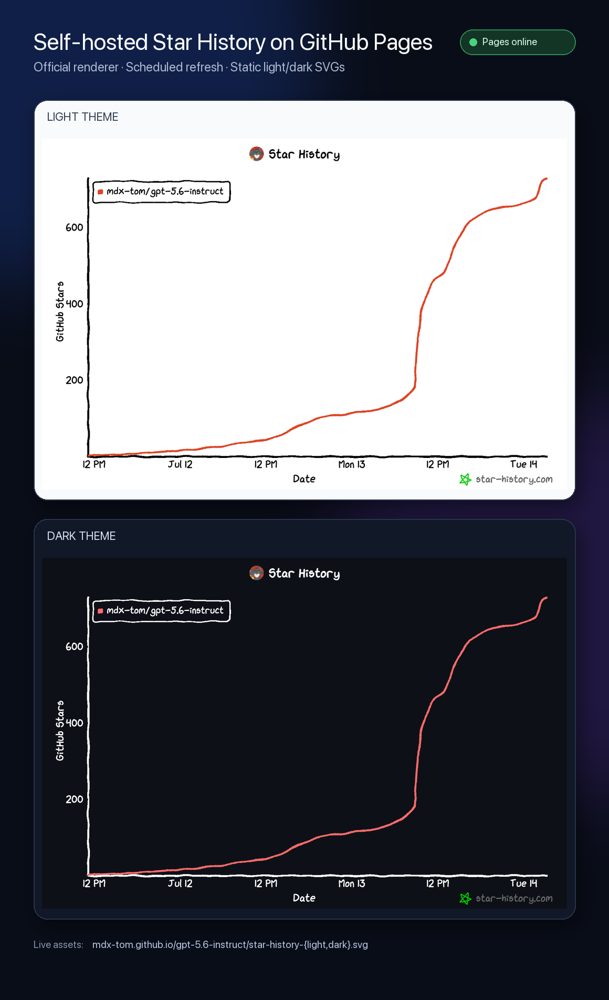
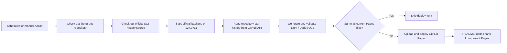

<h1 align="center">⭐ Deploy Star History Pages</h1>

<p align="center">
  Run the official Star History renderer in GitHub Actions and publish your repository's light and dark charts to GitHub Pages.
</p>

<p align="center">
  <a href="skills/deploy-star-history-pages/SKILL.md"></a>
  
  
  
  <a href="LICENSE"></a>
</p>

<p align="center">
  <a href="README.md">简体中文</a> · <strong>English</strong>
</p>

> [!IMPORTANT]
> **This skill directly addresses the frequent outages, rate limits, and malformed responses of the hosted `star-history.com` image API that can leave GitHub READMEs without a live Star History chart.**
>
> Instead of hotlinking `api.star-history.com`, it starts the official Star History backend inside your own GitHub Actions runner, reads GitHub star data directly, generates SVGs, and deploys stable static copies to the repository's own GitHub Pages site. Previously deployed charts remain visible even while the hosted chart API is unavailable.



<p align="center"><sub>Real output from the GitHub Pages deployment for <a href="https://github.com/MDX-Tom/gpt-5.6-instruct">MDX-Tom/gpt-5.6-instruct</a>.</sub></p>

## Why this exists

The hosted Star History image is convenient, but it makes every README render depend on an external dynamic endpoint. An outage, timeout, rate limit, or expired authentication parameter can turn the chart into a broken image.

`deploy-star-history-pages` turns chart generation into a reproducible repository-owned deployment:

| | Hosted image API | This skill's GitHub Pages pipeline |
| --- | --- | --- |
| Image source | README calls an external dynamic endpoint | README loads static SVGs from the repository's own Pages site |
| Failure isolation | Hosted API failures immediately affect the README | The last deployment remains available between runs |
| Freshness | Generated on request | Every 12 hours by default, plus manual runs |
| Renderer | Hosted service | Official `star-history/star-history` source in Actions |
| Color schemes | Query-parameter dependent | Separate light and dark SVGs |
| Credentials | URL parameters or hosted policy | GitHub Secret used only in a runner temporary file |
| Deployment | Opaque | Pages deploys only when SVG bytes change |

## Highlights

- **Removes the hosted image API as a single point of failure**: no README reference to `api.star-history.com/chart`.
- **Keeps the official rendering style**: checks out `star-history/star-history` and starts its local backend during each run.
- **Targets the repository itself**: infers `owner/repository` from the Git remote or accepts it explicitly.
- **Adapts to light and dark themes**: publishes `star-history-light.svg` and `star-history-dark.svg` for a README `<picture>` element.
- **Scheduled and manual refreshes**: runs every 12 hours by default and exposes `workflow_dispatch`.
- **Deploys only on change**: skips the Pages upload when both SVGs match the current deployment.
- **Validates output integrity**: checks Content-Type, SVG/XML structure, repository markers, chart labels, and theme background.
- **Uses minimal workflow permissions**: only `contents: read`, `pages: write`, and `id-token: write`.
- **Handles tokens carefully**: masks the secret, removes upstream token-fragment logging, uses a restricted runner temporary file, and cleans it up.
- **Uses an audited upstream pin by default**: keep the tested official commit SHA or explicitly choose `main` to follow upstream.

## How it works



The implementation has three reusable pieces:

1. **Installer**: detects the repository and Pages URL, generates project-specific files, and protects different existing files from accidental replacement.
2. **Local rendering bridge**: accepts only a loopback backend, downloads and validates both SVGs, then writes them atomically.
3. **GitHub Actions workflow**: starts the official backend, manages the temporary token file, compares the previous charts, and deploys Pages.

## Install the skill

### Skills CLI

```bash
npx skills add MDX-Tom/star-history-skill \
  --skill deploy-star-history-pages \
  -g -a codex -y
```

Remove `-g` for a project-local installation, or replace `codex` with another agent supported by the Skills CLI.

### Local development install

From this repository root:

```bash
mkdir -p ~/.codex/skills
ln -sfn "$PWD/skills/deploy-star-history-pages" \
  ~/.codex/skills/deploy-star-history-pages
```

## Quick start

Invoke the skill inside the target GitHub project:

```text
Use $deploy-star-history-pages to deploy this repository's own Star History.
Update both README languages with GitHub Pages light/dark SVGs and run local validation.
```

The agent will:

1. Read project instructions, READMEs, the Git remote, and existing Pages configuration.
2. Generate `.github/scripts/render_star_history.py`.
3. Generate `.github/workflows/sync-star-history.yml`.
4. Replace hosted API image URLs with a project Pages `<picture>` block in every maintained README.
5. Run Python compilation, placeholder, workflow, and diff checks.
6. Report any remaining Secret or Pages setup. When deployment is explicitly requested and `gh` is authenticated, it can also trigger and verify the remote workflow.

### Run the installer directly

Generate the base files without an agent:

```bash
python3 skills/deploy-star-history-pages/scripts/install.py \
  --root /path/to/your-repository \
  --repository owner/repository
```

Useful options:

```text
--dry-run                 Print the plan without writing
--force                   Replace different existing generated files
--pages-url URL           Use a custom domain or non-default Pages URL
--source-ref REF          Select an official branch, tag, or commit SHA
--cron "23 */12 * * *"   Customize the UTC refresh schedule
--no-snippet              Suppress the README snippet
```

The installer prints a README-ready block:

```html
<picture>
  <source media="(prefers-color-scheme: dark)" srcset="https://owner.github.io/repository/star-history-dark.svg" />
  <source media="(prefers-color-scheme: light)" srcset="https://owner.github.io/repository/star-history-light.svg" />
  
</picture>
```

## First deployment setup

### 1. Create a GitHub token

Prefer an expiring fine-grained personal access token limited to the target repository and read-only access. Public repositories normally need only Metadata/Stargazer reads; avoid write access and broad `repo` scope.

### 2. Add the repository secret

The exact secret name is:

```text
STAR_HISTORY_GITHUB_TOKEN
```

With GitHub CLI, pass the value over standard input so it stays out of shell history:

```bash
printf '%s' "$STAR_HISTORY_GITHUB_TOKEN" | \
  gh secret set STAR_HISTORY_GITHUB_TOKEN --repo owner/repository
```

### 3. Enable GitHub Actions as the Pages source

Open:

```text
Settings → Pages → Build and deployment → Source → GitHub Actions
```

### 4. Run and verify

```bash
gh workflow run sync-star-history.yml --repo owner/repository
gh run watch --repo owner/repository --exit-status

curl -fL https://owner.github.io/repository/star-history-light.svg -o /tmp/star-history-light.svg
curl -fL https://owner.github.io/repository/star-history-dark.svg -o /tmp/star-history-dark.svg
```

After the first deployment, the README should load:

```text
https://owner.github.io/repository/star-history-light.svg
https://owner.github.io/repository/star-history-dark.svg
```

## Generated project files

```text
.github/
├── scripts/
│   └── render_star_history.py
└── workflows/
    └── sync-star-history.yml
```

The Pages artifact contains only:

```text
.nojekyll
star-history-light.svg
star-history-dark.svg
```

The token, runner logs, upstream source, dependencies, and temporary comparison files are not published.

## Validation

Validate this skill repository with:

```bash
python3 -m py_compile \
  skills/deploy-star-history-pages/scripts/install.py \
  skills/deploy-star-history-pages/assets/render_star_history.py

python3 -m unittest discover -s tests -v

git diff --check
```

Skill maintainers should also use the Codex `skill-creator` bundled `quick_validate.py` to validate `SKILL.md` metadata.

After installation into a target repository, also run this when `actionlint` is available:

```bash
actionlint .github/workflows/sync-star-history.yml
```

## FAQ

### Why not pass `${{ github.token }}` directly to the official backend?

This skill generalizes the deployment proven in `gpt-5.6-instruct`: it uses an explicit repository secret and narrows the official backend's startup token check to the target repository. That works cleanly with repository-scoped fine-grained tokens and provides authenticated GitHub API capacity.

### What happens during another `star-history.com` outage?

The README loads already deployed SVGs from your Pages site, not the hosted image API. Existing charts remain visible. Future refreshes read GitHub's API directly and run the official renderer inside the Actions runner.

### Can I refresh more often?

Yes, with `--cron`, but account for GitHub API rate limits, Actions usage, repository star growth, and Pages deployment frequency. Every 12 hours is near-real-time enough for most projects.

### Are custom domains supported?

Yes. Pass `--pages-url https://stars.example.com` after configuring the Pages custom domain.

### What if an upstream update breaks the workflow?

Use the failure table in [`operations.md`](skills/deploy-star-history-pages/references/operations.md). A changed `backend/token.ts` implementation is a common cause. After updating and testing the narrow patch, pin the validated version with `--source-ref <commit-sha>`.

### What about private repositories?

Support depends on the GitHub plan, Pages visibility, and token permissions. A published chart may disclose repository existence or growth information, so confirm the required visibility before deployment.

## Origin and acknowledgements

This skill was extracted from the production Star History workflow in [`MDX-Tom/gpt-5.6-instruct`](https://github.com/MDX-Tom/gpt-5.6-instruct). It preserves and generalizes these proven design choices:

- check out and run the official Star History source in Actions;
- render light and dark SVGs through a local backend;
- use a repository secret and target-repository token validation;
- validate and atomically write SVG output;
- compare against the current Pages deployment and deploy only on change;
- switch themes in README with `<picture>`.

The renderer comes from [`star-history/star-history`](https://github.com/star-history/star-history). The README's high-signal structure draws inspiration from excellent GitHub agent-skill projects including [`anthropics/skills`](https://github.com/anthropics/skills), [`vercel-labs/agent-skills`](https://github.com/vercel-labs/agent-skills), and [`obra/superpowers`](https://github.com/obra/superpowers).

## License

[MIT](LICENSE)
