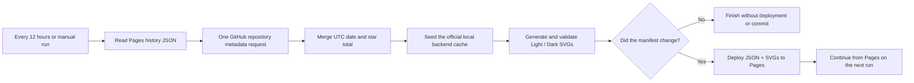

<h1 align="center">⭐ Deploy Star History Pages</h1>

<p align="center">
  Run star-history.com's official open-source renderer in GitHub Actions, persist project-owned data on GitHub Pages, and publish the repository's light/dark charts and history state to its own Pages site—without depending on third-party cloud data or external APIs.
</p>

<p align="center">
  <a href="skills/deploy-star-history-pages/SKILL.md"></a>
  
  
  
  <a href="LICENSE"></a>
</p>

<p align="center">
  <a href="README.md">简体中文</a> · <strong>English</strong>
</p>

> [!IMPORTANT]
> **This skill keeps GitHub README charts working when the hosted Star History image service is unavailable, rate-limited, or malformed.**
>
> The README no longer hotlinks `api.star-history.com`. The workflow runs a pinned revision of the official renderer in the repository's own Actions runner, makes one GitHub repository-metadata request, and publishes light/dark SVGs plus date/star-count JSON to the project's Pages site. It needs no PAT, never requests the individual Stargazer list, and does not preserve history through scheduled Git commits.

<table width="100%">
  <tr>
    <th width="50%">Light</th>
    <th width="50%">Dark</th>
  </tr>
  <tr>
    <td></td>
    <td></td>
  </tr>
</table>

<p align="center"><sub>Real output from the GitHub Pages deployment for <a href="https://github.com/MDX-Tom/gpt-5.6-instruct">MDX-Tom/gpt-5.6-instruct</a>.</sub></p>

## Why this exists

Hosted images are convenient, but every README render then depends on an external dynamic endpoint. A timeout, rate limit, or expired authentication parameter can turn the chart into a broken image.

`deploy-star-history-pages` moves generation, state, and delivery back into the repository:

| | Hosted image endpoint | This skill's Pages pipeline |
| --- | --- | --- |
| Image source | README calls an external dynamic endpoint | README loads static SVGs from the repository's own Pages site |
| Failure isolation | Endpoint failures immediately affect the README | The previous Pages artifact remains available between refreshes |
| Freshness | Generated on request | Every 12 hours by default, plus manual runs |
| Data requests | Hosted policy is opaque | One repository-metadata read per run; no Stargazer listing |
| Renderer | Hosted service | Official `star-history/star-history` source in the runner |
| History state | Service-managed | `star-history-data.json` on the project's Pages site |
| Credentials | URL parameters or hosted policy | Job-scoped `${{ github.token }}` only; no Secret |
| Git history | Not applicable | Scheduled refreshes create no commits |
| Pages deployments | Opaque | Deploy only when the JSON/SVG manifest changes |

## Install the skill

### Skills CLI

```bash
npx skills add MDX-Tom/star-history-skill \
  --skill deploy-star-history-pages \
  -g -a codex -y
```

Remove `-g` for a project-local installation, or replace `codex` with another agent supported by the Skills CLI.

### Local development install

From this repository root:

```bash
mkdir -p ~/.codex/skills
ln -sfn "$PWD/skills/deploy-star-history-pages" \
  ~/.codex/skills/deploy-star-history-pages
```

## Quick start

Invoke the skill inside the target GitHub project:

```text
Use $deploy-star-history-pages to deploy this repository's own Star History.
Update both README languages with GitHub Pages light/dark SVGs and run local validation.
```

The agent will:

1. Read project instructions, READMEs, the Git remote, and existing Pages configuration.
2. Detect legacy `.github/scripts/render_star_history.py` and remove an unused copy only after review.
3. Generate the unified `.github/scripts/star_history.py`.
4. Generate the `.github/data/star-history-data.json` cold-start seed.
5. Generate `.github/workflows/sync-star-history.yml`.
6. Replace hosted image URLs with a project Pages `<picture>` block.
7. Run Python, placeholder, workflow, test, and diff checks.
8. Report the remaining Pages setting; it triggers and verifies a remote run only when requested.

### Run the installer directly

```bash
python3 skills/deploy-star-history-pages/scripts/install.py \
  --root /path/to/your-repository \
  --repository owner/repository
```

Useful options:

```text
--dry-run                 Print the plan without writing
--force                   Replace different existing generated files
--pages-url URL           Use a custom domain or non-default Pages URL
--source-ref REF          Select an official branch, tag, or commit SHA
--cron "23 */12 * * *"   Customize the UTC refresh schedule
--no-snippet              Suppress the README snippet
```

The installer prints a README-ready block:

```html
<picture>
  <source media="(prefers-color-scheme: dark)" srcset="https://owner.github.io/repository/star-history-dark.svg" />
  <source media="(prefers-color-scheme: light)" srcset="https://owner.github.io/repository/star-history-light.svg" />
  
</picture>
```

## First deployment setup

### 1. Enable GitHub Actions as the Pages source

Open:

```text
Settings → Pages → Build and deployment → Source → GitHub Actions
```

No PAT or repository secret is needed. The workflow uses the automatically provided `${{ github.token }}` only for the current job.

### 2. Run and verify

```bash
gh workflow run sync-star-history.yml --repo owner/repository
gh run watch --repo owner/repository --exit-status

curl -fL https://owner.github.io/repository/star-history-data.json -o /tmp/star-history-data.json
curl -fL https://owner.github.io/repository/star-history-light.svg -o /tmp/star-history-light.svg
curl -fL https://owner.github.io/repository/star-history-dark.svg -o /tmp/star-history-dark.svg
```

When the default seed starts the first deployment, history begins with two points: zero at repository creation and the current total. Future runs maintain UTC-date snapshots. The pipeline deliberately does not query each Stargazer's historical timestamp. To migrate an exact existing curve, provide validated history JSON before the first deployment or keep the existing Pages JSON reachable.

## Highlights

- **Removes the hosted image API**: neither the README nor workflow calls `api.star-history.com/chart`.
- **Preserves the official visual path**: keeps the official JSDOM, `XYChart`, xkcd style, themes, and SVGO output.
- **No PAT or Secret**: one repository-metadata request uses the short-lived `${{ github.token }}`.
- **No Stargazer listing**: reads only current `stargazers_count`, avoiding pagination, secondary limits, and identity processing.
- **Pages-hosted runtime history**: automatically reads and updates public `star-history-data.json`.
- **No automated commits**: scheduled jobs deploy a Pages artifact without changing a Git branch.
- **Daily coalescing**: updates the last point on the same UTC date and appends on a new date.
- **Light/dark adaptation**: publishes both SVG themes for a README `<picture>` element.
- **Deploys only on change**: skips Pages deployment when the JSON/SVG manifest is unchanged.
- **Fail-closed state recovery**: only a Pages JSON 404 selects the seed; other download or validation failures stop the refresh.
- **Audited upstream pin**: uses a reviewed official source commit by default.
- **Deployment-record cleanup**: retains the newest `github-pages` deployment without touching Git commit history.

## How it works



The unified script exposes three subcommands:

1. `refresh-data`: read Pages JSON, query the current repository total, and update daily history.
2. `patch-upstream`: narrowly adapt the pinned official backend so local JSON initializes its cache.
3. `render`: access only `127.0.0.1`, validate both themes, and write them atomically; a temporary local-render failure can reuse the previous Pages pair.

## Generated project files

```text
.github/
├── data/
│   └── star-history-data.json
├── scripts/
│   └── star_history.py
└── workflows/
    └── sync-star-history.yml
```

The Pages artifact contains:

```text
.nojekyll
manifest.sha256
star-history-data.json
star-history-light.svg
star-history-dark.svg
```

`.github/data/star-history-data.json` is the cold-start seed; the same-named Pages file is the normal runtime source of truth. No manual synchronization is needed during normal operation. Only copy Pages JSON back into the repository in a reviewed maintenance commit when an additional cold backup is desired.

## Validation

```bash
python3 -m py_compile \
  skills/deploy-star-history-pages/scripts/install.py \
  skills/deploy-star-history-pages/assets/star_history.py

python3 -m unittest discover -s tests -v

git diff --check
```

After installation, run this when `actionlint` is available:

```bash
actionlint .github/workflows/sync-star-history.yml
```

Skill maintainers should also run Codex `skill-creator`'s `quick_validate.py` for `SKILL.md` metadata and perform one temporary-repository installation test.

## FAQ

### Where is the history JSON stored?

Runtime state lives at `star-history-data.json` on the project's Pages site, which Actions reads and updates automatically. `.github/data/star-history-data.json` is only the first-deploy/reset seed. Normal operation needs no manual synchronization.

### Does every 12-hour run create a commit?

No. The workflow deploys a Pages artifact and never writes to the Git branch. When the manifest is unchanged, it skips the Pages deployment too.

### Do I need to configure an access token?

No. The default workflow uses GitHub's automatically injected, job-scoped `${{ github.token }}` for one repository-metadata request.

### What happens during another hosted `star-history.com` outage?

The README loads SVGs from the project's own Pages site and refreshes do not call the hosted chart endpoint, so that outage is outside this path. The workflow still requires the official GitHub source repository and npm dependencies to be reachable.

### Can I refresh more often?

Yes, through `--cron`. Each run makes only one repository-metadata request, but Actions and Pages usage should still be considered.

### What if the Pages site is deleted?

A Pages JSON 404 selects the repository seed. The default seed reinitializes a two-point curve. For disaster recovery, periodically make a reviewed manual copy of Pages JSON under `.github/data/`; see [`operations.md`](skills/deploy-star-history-pages/references/operations.md).

### What if an upstream update breaks the workflow?

Use [`operations.md`](skills/deploy-star-history-pages/references/operations.md). Inspect `backend/main.ts` startup and the `/svg` route, then update the pinned SHA only after building and visually validating both themes.

### What about private repositories?

Support depends on the GitHub plan and Pages visibility. Public JSON/SVG output reveals the repository name and growth trend, so confirm the required visibility first.

## Origin and acknowledgements

This skill synchronizes and generalizes the current production design from [`MDX-Tom/gpt-5.6-instruct`](https://github.com/MDX-Tom/gpt-5.6-instruct):

- Pages JSON as runtime history;
- one repository-metadata request per run;
- local cache injection into the official renderer;
- complete light/dark SVG validation;
- manifest-based deployment;
- no PAT, no individual Stargazer list, and no scheduled Git commit.

Chart rendering comes from the official open-source [`star-history/star-history`](https://github.com/star-history/star-history) repository.

## License

[MIT](LICENSE)
